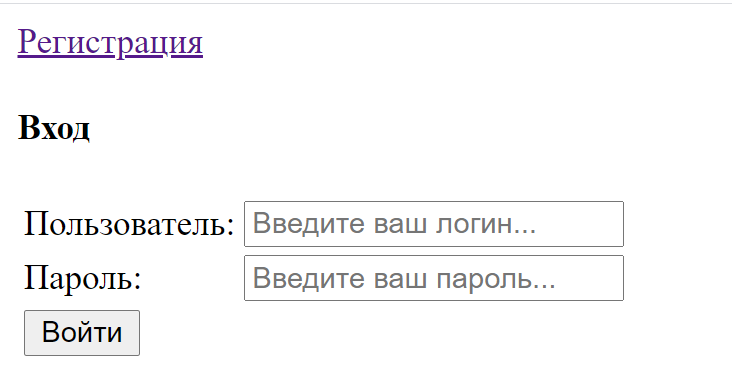
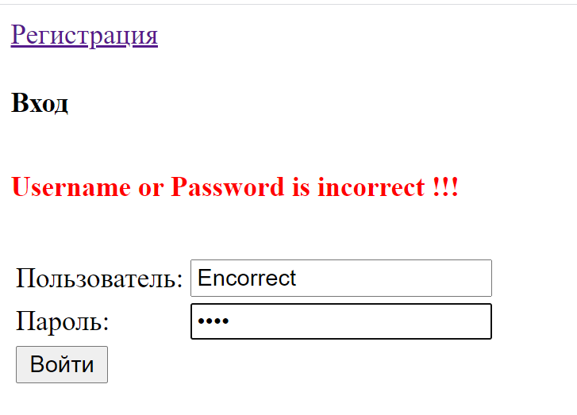
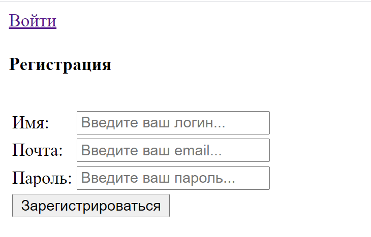
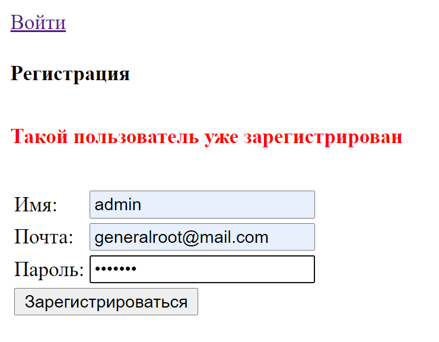
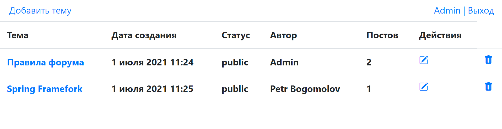
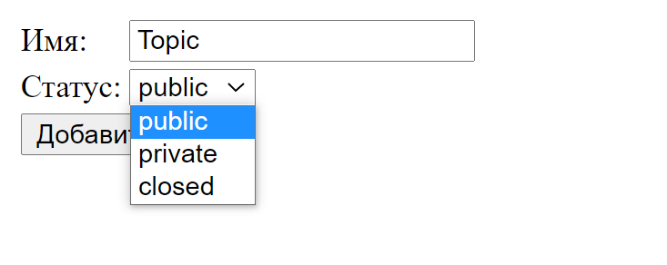
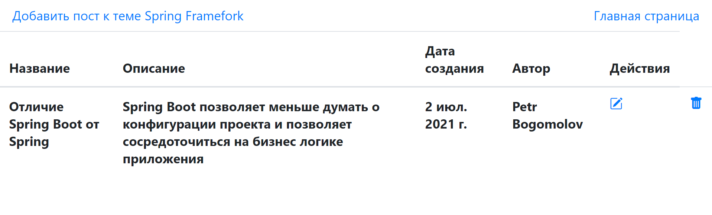
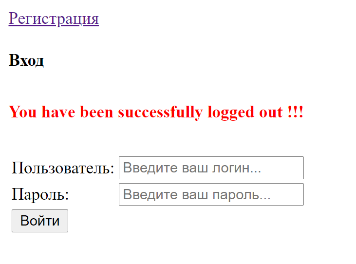

### Веб-приложение форум

Проект размещён на облачной PaaS-платформе [Heroku](https://spring-boot-forum-12232.herokuapp.com).

### Технологии:
 
 * Spring (Boot, Core, MVC, Data, Security)
 
 * Hibernate
 
 * PostgreSQL
 
 * Liquibase
 
 * Maven
 
 * JSP, HTML
 
 * Travis CI, CheckStyle
 
 * Heroku
 
### Функционал:
 
 * Регистрация пользователя
 (Регистрация пользователя с одинаковым логином и email запрещена)
 
 * Аутентификация пользователя
 
 * Организация матрицы ролей с разным уровнем 
 прав для Администратора и Пользователя
 
   права ADMIN:
   
   - Добавление темы
   
   - Редактирование любой темы
   
   - Редактирование статуса темы
   
   - Удаление любой темы
   
   - Добавление любого поста
   
   - Редактирование любого поста
   
   - Удаление любого поста
   
   права USER:
   
   - Добаление темы
   
   - Редактирование своей темы
   
   - Удаление своей темы
   
   - Добавление поста
      
   - Редактирование своего поста
      
   - Удаление своего поста
   
-----------------------------------------------
   
#### Страница авторизации

   

------------------------------------------------
   
#### Страница регистрации

   

------------------------------------------------
   
#### Гланая стараница форума со списком тем для обсуждения

-------------------------------------------------
   
#### Страница добавления темы

---------------------------------------------------
   
#### Страница постов под этой темой

-------------------------------------------------------
   
#### Выход

 